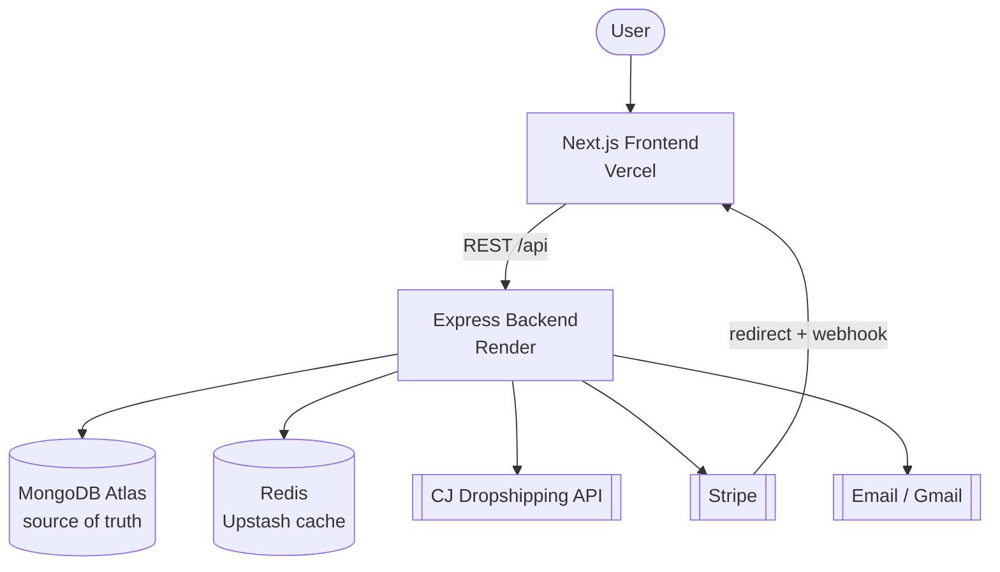
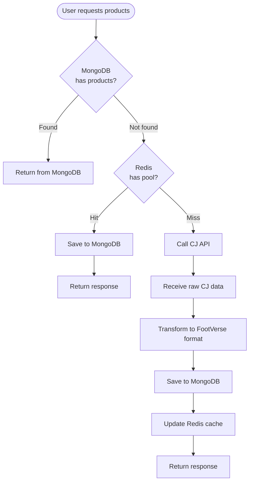
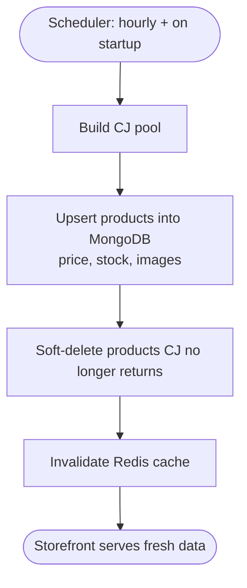
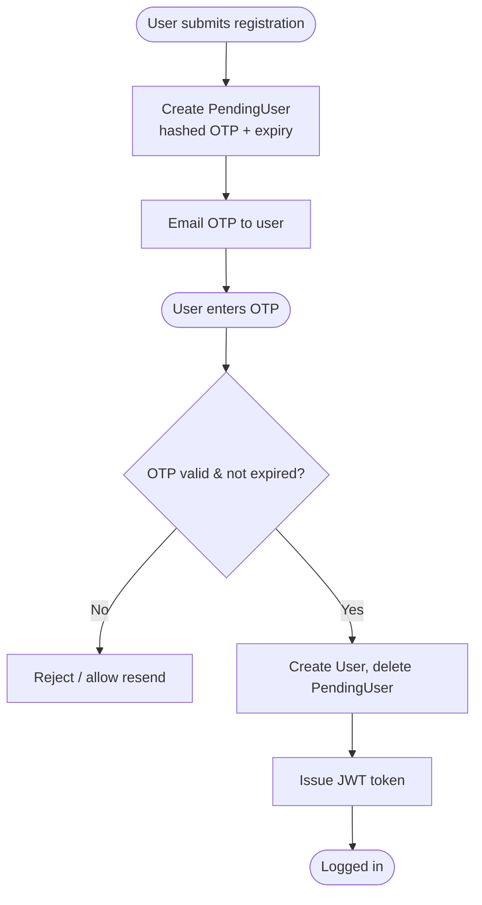
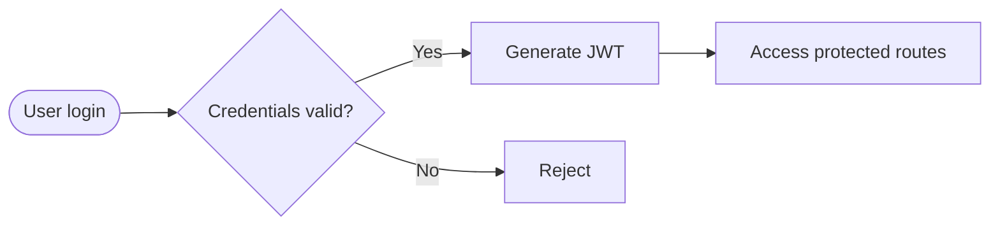
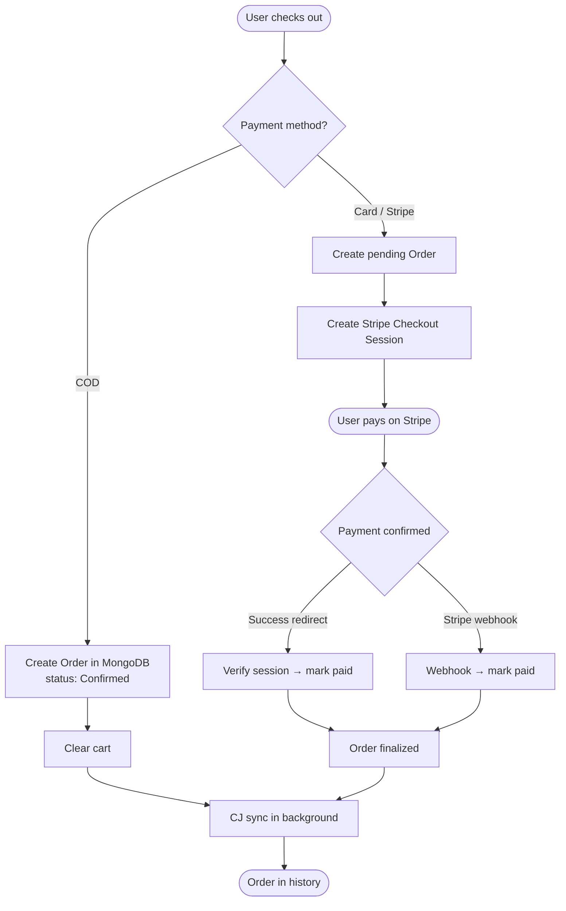
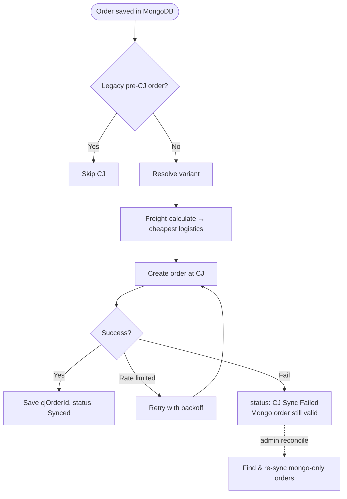
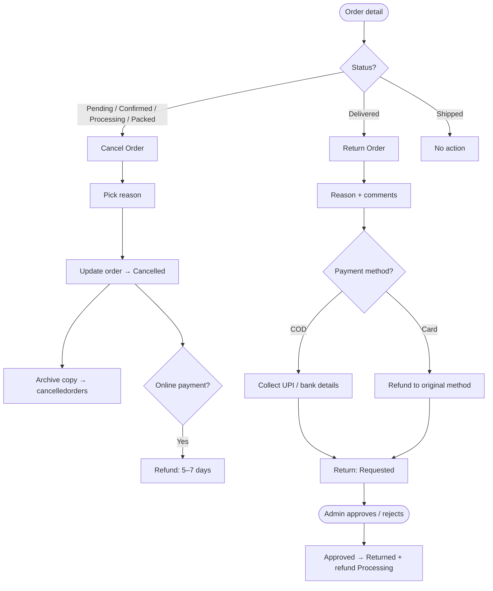
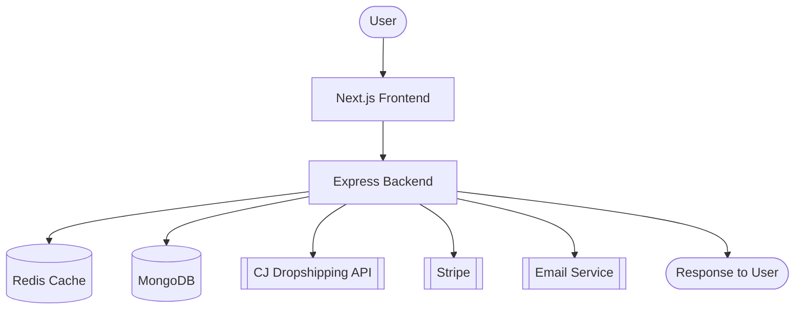
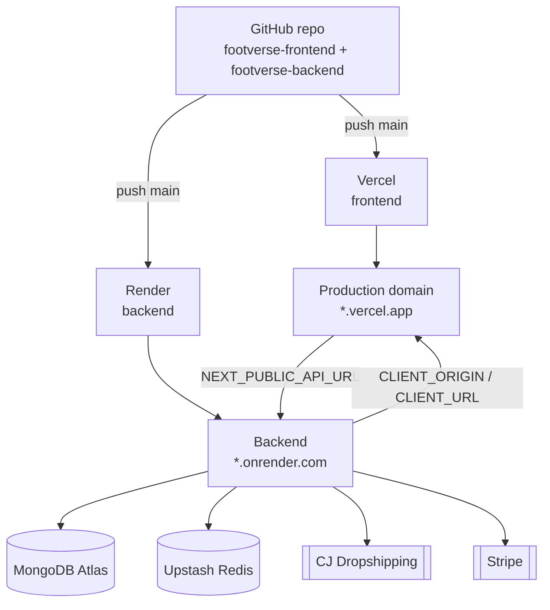

# FootVerse

> **Your Universe of Footwear**
> A modern full-stack footwear e-commerce platform that brings together **live product sourcing**, **secure authentication**, **fast performance**, and **seamless online shopping**. Built using **Next.js**, **Express.js**, **MongoDB**, **Redis**, **Stripe**, and the **CJ Dropshipping API**.


---

## Project Overview

FootVerse is a full-stack footwear e-commerce platform that demonstrates modern software engineering practices and real-world e-commerce architecture.

Unlike traditional stores that manually manage inventory, FootVerse integrates directly with **CJ Dropshipping** to source live product data. Products are fetched, transformed into a consistent format, stored in **MongoDB** (the source of truth), cached in **Redis**, and displayed through a responsive **Next.js** frontend.

The platform provides a complete shopping experience: user authentication with OTP verification, product search and filtering, wishlist, shopping cart, secure Stripe payments, Cash-on-Delivery, full order management, order cancellation and returns, and an admin dashboard.

The project follows a modular architecture with separate frontend and backend services, making it scalable, maintainable, and cloud-ready on **Vercel** and **Render**.

---

## Project Objectives

- Build a modern full-stack e-commerce application.
- Source live products from CJ Dropshipping with MongoDB as the source of truth.
- Implement secure authentication using JWT and email OTP verification.
- Improve performance using Redis caching.
- Enable secure online payments using Stripe, plus Cash on Delivery.
- Provide complete order management, including cancellation, returns, and refunds.
- Follow scalable backend architecture and clean coding practices.
- Deploy using modern cloud platforms.

---

## Features

### User Authentication
- User registration with email OTP verification
- Secure login (JWT)
- Forgot password / reset password
- Protected routes
- Logout

### Product Management
- Live product sourcing from CJ Dropshipping
- MongoDB-backed catalog (source of truth) with hourly sync
- Product categories, search, filtering, and sorting
- Product variants and size selection
- Product details and related products
- Automatic soft-delete of products CJ no longer offers

### Wishlist
- Add/remove products
- Persistent wishlist for logged-in users

### Shopping Cart
- Add/remove items and update quantity
- Automatic price calculation
- Guest cart that merges on login

### Checkout & Payments
- Secure Stripe card payments
- Cash on Delivery (COD)
- Shipping information and order summary
- Payment confirmation via redirect and webhook

### Order Management
- Place orders (Stripe or COD)
- Order history and order details
- Order status lifecycle (Confirmed → Processing → Packed → Shipped → Delivered)
- CJ Dropshipping order synchronization
- Order cancellation with reasons and refunds
- Return requests with admin approval
- Cancelled-order archive collection

### Admin
- View and manage returns and cancellations
- Approve/reject returns, mark refunds complete
- Advance order fulfillment status
- Reconcile MongoDB ↔ CJ order consistency
- Manual product sync

### Email Services
- OTP verification email
- Password reset email

### Performance Optimization
- Redis caching of product responses
- Faster API responses and fewer CJ API calls
- MongoDB as primary source, reducing repeated external requests

---

## Tech Stack

### Frontend

| Technology | Why It Was Used |
| --- | --- |
| **Next.js (App Router)** | Server-side rendering, file-based routing, and strong performance for a modern storefront. |
| **React.js** | Reusable UI components and efficient interface management. |
| **JavaScript (ES6+)** | Application logic across frontend and backend. |
| **Tailwind CSS** | Responsive, clean, utility-first styling. |
| **Framer Motion** | Hero animations, page transitions, hover effects, and interactive UI. |
| **Context API** | Global state for auth, cart, and wishlist without prop drilling. |

### Backend

| Technology | Why It Was Used |
| --- | --- |
| **Node.js** | JavaScript runtime for the backend server. |
| **Express.js** | RESTful APIs, routing, middleware, and business logic. |
| **MongoDB** | Stores users, products, carts, orders, wishlists, and more. |
| **Mongoose** | Schemas, models, and validation for MongoDB. |
| **Redis** | Caches product responses to cut latency and CJ API calls. |
| **JWT** | Secure authentication and protected routes. |
| **bcryptjs** | Password hashing before storage. |
| **Nodemailer** | OTP and password-reset emails. |
| **Stripe** | Secure online card payments. |
| **dotenv** | Manages environment variables. |
| **Express Rate Limit** | Protects auth/OTP endpoints from abuse. |
| **CORS** | Secure frontend↔backend communication across origins. |

### Third-Party Integrations

| Service | Why It Was Used |
| --- | --- |
| **CJ Dropshipping API** | Live product data, variants, freight calculation, and order processing. |
| **Stripe API** | Secure payment processing and confirmation. |
| **SMTP Email (Gmail)** | Delivers OTP and password-reset emails via Nodemailer. |

### Development Tools

| Tool | Why It Was Used |
| --- | --- |
| **Git / GitHub** | Version control and repository hosting. |
| **VS Code** | Primary editor. |
| **Postman** | API testing. |
| **npm** | Dependency management and scripts. |

---

## System Architecture

FootVerse follows a modular client-server architecture where the frontend, backend, database, cache, and third-party services are separated for scalability and maintainability.



- **Frontend:** UI, product browsing, authentication, cart, wishlist, checkout.
- **Backend:** API requests, authentication, business logic, payments, external services.
- **MongoDB:** Source of truth for users, products, orders, and more.
- **Redis:** Caches frequently accessed product data.
- **CJ Dropshipping:** Live product data and order synchronization.
- **Stripe:** Secure online payments.

---

## Product Data Flow (MongoDB → Redis → CJ)

**MongoDB is the primary source of truth.** Redis caches responses; CJ is the fallback and the hourly refresh source.



### Hourly Product Sync



**Benefits:** no manual inventory, always-updated catalog, faster loading, lower CJ API usage, and resilience — if Redis or CJ is unavailable, the store still serves from MongoDB.

---

## Authentication Flow

FootVerse uses **JWT** for authentication with **email OTP verification** at registration. A `PendingUser` holds the data and hashed OTP until verified, then a real `User` is created.



### Login



**Security features:** bcrypt password hashing, JWT authentication, OTP email verification, protected API routes, rate-limited auth endpoints, and password reset.

---

## Order & Payment Flow

Two payment paths. **COD** finalizes immediately; **Stripe** finalizes after payment is confirmed via redirect *and* webhook (idempotent).



---

## CJ Order Synchronization

After an order is saved in MongoDB, it syncs to CJ so the supplier fulfills it. Freight is calculated dynamically for the destination; legacy pre-CJ orders are skipped.



The order **always** saves in MongoDB first; CJ is secondary and self-healing via the admin reconcile tools.

---

## Order Cancellation & Return



---

## Database Overview

MongoDB stores all application data in separate collections.

| Collection | Purpose |
| --- | --- |
| `users` | Registered users, addresses, admin flag |
| `pendingusers` | Registration data + OTP until verified |
| `products` | CJ product snapshots (source of truth) + lifecycle fields |
| `categories` | Category metadata |
| `carts` | Per-user shopping carts |
| `wishlists` | Per-user wishlists |
| `orders` | All orders, timeline, CJ sync, cancel/return/refund |
| `cancelledorders` | Full archived copy of each cancelled order |
| `transactions` | Payment transaction records |

---

## Application Workflow



---

## Performance Optimizations

- Redis caching for frequently accessed product data.
- MongoDB as primary source, reducing repeated CJ calls.
- Cache invalidation on every product sync (no stale listings).
- Modular backend architecture and reusable React components.
- Efficient API response handling.

---

## Security Measures

- JWT-based authentication
- Password hashing with bcrypt
- OTP email verification
- Protected backend routes and rate-limited auth endpoints
- Secure payment processing with Stripe
- Input validation and error handling
- Environment variables for sensitive credentials
- Idempotent payment finalization (safe redirect + webhook)

---

## Folder Structure

```text
FootVerse/
│
├── footverse-frontend/
│   ├── src/
│   │   ├── app/
│   │   ├── components/
│   │   ├── context/
│   │   ├── hooks/
│   │   ├── lib/
│   │   └── data/
│   ├── public/
│   └── package.json
│
├── footverse-backend/
│   ├── src/
│   │   ├── config/
│   │   ├── controllers/
│   │   ├── middleware/
│   │   ├── models/
│   │   ├── routes/
│   │   ├── services/
│   │   ├── transformers/
│   │   ├── utils/
│   │   └── server.js
│   └── package.json
│
├── README.md
└── .gitignore
```

| Folder | Description |
| --- | --- |
| **footverse-frontend/** | Next.js application with all UI components and pages |
| **footverse-backend/** | Express.js backend with REST APIs |
| **controllers/** | Business logic for API requests |
| **routes/** | API endpoint definitions |
| **models/** | MongoDB schemas |
| **middleware/** | Authentication, CORS, and rate-limiting |
| **services/** | CJ, Stripe, product, order, sync, and email logic |
| **transformers/** | Convert raw CJ data into FootVerse format |
| **utils/** | Helpers, including Redis cache utilities |
| **config/** | Database and Redis configuration |

---

## Getting Started

### Prerequisites

- Node.js (v18 or above)
- npm
- MongoDB
- Redis
- Git

You will also need accounts for:

- CJ Dropshipping
- Stripe
- Gmail (App Password for email)
- MongoDB Atlas *(for cloud deployment)*
- Redis / Upstash *(for cloud deployment)*

---

## Installation

### 1. Clone the Repository

```bash
git clone https://github.com/PrachiSirola/FootVerse.git
cd FootVerse
```

### 2. Install Backend Dependencies

```bash
cd footverse-backend
npm install
```

### 3. Install Frontend Dependencies

```bash
cd ../footverse-frontend
npm install
```

---

## Environment Variables

### Backend

Create a `.env` file inside **footverse-backend/** with the following keys (leave values blank here; fill them in locally — never commit real secrets):

```env
PORT=5000

MONGO_URI=
REDIS_URL=
JWT_SECRET=

CJ_API_KEY=
CJ_API_BASE=
CJ_POOL_PER_KEYWORD=20
PRODUCT_SYNC_MS=3600000

STRIPE_SECRET_KEY=

MAIL_USER=
MAIL_PASS=
MAIL_FROM=

CLIENT_URL=http://localhost:3000
CLIENT_ORIGIN=http://localhost:3000
```

### Frontend

Create a `.env.local` file inside **footverse-frontend/**:

```env
NEXT_PUBLIC_API_URL=http://localhost:5000
```

> **Note:** `NEXT_PUBLIC_API_URL` is the backend **root** URL — the app appends `/api` automatically. Do not include `/api` or a trailing slash. Keep all `.env` files out of Git.

---

## Running the Project

### 1. Start MongoDB

```bash
mongod
```

### 2. Start Redis

```bash
redis-server
```

### 3. Start Backend

```bash
cd footverse-backend
node src/server.js
```

Backend runs on `http://localhost:5000`. On first start it seeds MongoDB from CJ and then syncs hourly.

### 4. Start Frontend

```bash
cd footverse-frontend
npm run dev
```

Frontend runs on `http://localhost:3000`.

---

## Deployment

The frontend and backend deploy independently.



### Frontend (Vercel)
- Connect the GitHub repository (root directory: `footverse-frontend`).
- Set `NEXT_PUBLIC_API_URL` to the backend root URL.
- Deploy.

### Backend (Render)
- Connect the GitHub repository (root directory: `footverse-backend`).
- Build command: `npm install` · Start command: `node src/server.js`.
- Add all backend environment variables.
- Set `CLIENT_ORIGIN` and `CLIENT_URL` to the frontend URL (for CORS and email links).
- Deploy.

### Connection rules
- **Frontend → Backend:** `NEXT_PUBLIC_API_URL` = backend root URL (no `/api`).
- **Backend → Frontend (CORS):** `CLIENT_ORIGIN` allows the frontend domain.

---

## Design Principles

- **MongoDB is the source of truth** — Redis and CJ are supporting layers.
- **Writes are never blocked by external services** — orders save first; CJ/Stripe are secondary and self-heal.
- **Idempotency** — payment finalization and syncs can safely run more than once.
- **Graceful degradation** — the storefront serves from MongoDB even if Redis or CJ is down.
- **Soft deletes** — removed CJ products are hidden, not destroyed, preserving order history.

---

## License

This project is developed for educational and portfolio purposes.
